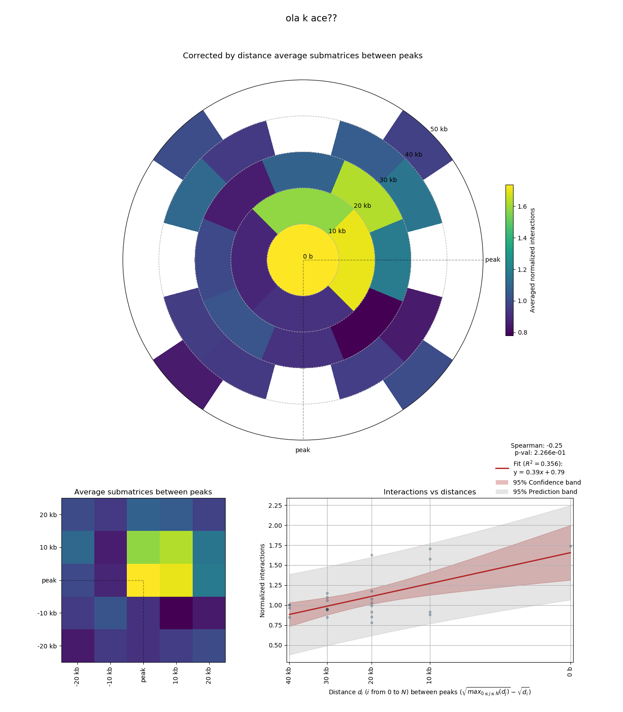

# metawaffle to PrognoTF

[](https://travis-ci.org/bsc-life/prognosTF)
[](https://coveralls.io/github/bsc-life/prognosTF)

## Requirements

 - scipy
 - numpy
 
### optional

 - TADbit to convert from TADbit BAM format to required
 - matplotlib to plot and check the result of tests

## Generate sub-matrices at a given resolution 



We will need sub-matrices from which we will extract sub-matrices.

To run it we need:
- Genomic interactions in four column format (see bellow)
- one or two lists of coordinates

The genomic matrices are in the form:
```
    388761 388761 364 0.461182349185
    388761 388762 66 0.166867406676
    388761 388763 142 0.554955487814
    388761 388764 4 0.0216862127515
```
    - First column: starting bin
    - Second column: end bin
    - Third column: raw count
    - Fourth column: normalized count


- resolution
- tmp directory to store the pre-processed files.
- output directory to store the results


- biases (in my case is a pickle file, as the output from TADbit using oneD biases), so if you want to use another one you should modify it.

And we generate:
- matrices per chromosome: folder where the matrices per chromosome are located. The format is the following:
Creation of such matrices with `bam2count.py`.

**Notice** that the chromosome 1 goes from bin 0 to (length of chromosome 1) / resolution, and chromosome 2 goes from the (length of chromosome 1) / resolution + 1,  until (length of chromosome 1) / resolution + 1 + (length of chromosome 2) / resolution. Example: chromosome 1 (length 10), chromosome 2 (length 5)
```
bins chromosome 1: from 0 -10.
bins chromosome 2: from 11-16.
```

Now these files have the name: chr{number}_bam_5kb.tsv

 - windows span: length of the windows to add around the center of the peak (bp)
 - max dist: maximum distance between centres of the peaks.

## Generate list of pairs of coordinates


Finally, this code is written to analyze the following intervals of distance between the peaks:

```
   windows = ((255000  , 1000000),
              (1000000 , 2500000),
              (2500000 , 5000000),
              (5000000 , 10000000),
              (10000000, 15000000),
              (15000000, 20000000),
              (20000000, 30000000))
```


